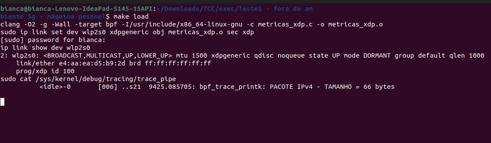

## INFORMAÇOES DA MÁQUINA - BIANCA
Dados do sistema operacional:

```bash
bianca@bianca-Lenovo-IdeaPad-S145-15API:~$ hostnamectl
Static hostname: bianca-Lenovo-IdeaPad-S145-15API
Icon name: computer-laptop
Chassis: laptop
Machine ID: 5d8ae96f185a4aeca5d53dcb706bf8cb
Boot ID: 0a3bdec0b37d40cbaa93fae0a6924a4e
Operating System: Ubuntu 22.04.5 LTS
Kernel: Linux 6.8.0-106-generic
Architecture: x86-64
Hardware Vendor: Lenovo
Hardware Model: Lenovo IdeaPad S145-15API
```

Dados da rede:

```bash
bianca@bianca-Lenovo-IdeaPad-S145-15API:~$ ip -br link show
lo               UNKNOWN        00:00:00:00:00:00 <LOOPBACK,UP,LOWER_UP>
wlp2s0           UP             e4:aa:ea:d5:b9:2d <BROADCAST,MULTICAST,UP,LOWER_UP>

bianca@bianca-Lenovo-IdeaPad-S145-15API:~$ ethtool -i wlp2s0
driver: ath10k_pci
version: 6.8.0-106-generic
firmware-version: WLAN.TF.2.1-00021-QCARMSWP-1
expansion-rom-version:
bus-info: 0000:02:00.0
supports-statistics: yes
supports-test: no
supports-eeprom-access: no
supports-register-dump: no
supports-priv-flags: no
```

O driver de rede não suporta XDP nativo, pois é de rede sem fio. Nesse caso, usei o modo genérico, que chama o programa em um nível mais alto da pilha. Para o projeto devo utilizar com Ethernet para usar o modo nativo e ter as vantagens do XDP.

## COMO RODAR OS PROGRAMAS MANUALMENTE

### Compilar - Opçao 01
```bash
clang -target bpf -O2 -c <nome_arquivo.c> -o <nome_arquivo.o>
```

- `clang` é o compilador
- `-target bpf` indica a estrutura de destino
- `-O2` define o nível de otimizaçao do compilador. Necessário por conta do verificador eBPF
- `-c` informa que é somente compilaçao, para nao linkar

### Compilar - Opçao 2
```bash
clang -O2 -g -Wall -target bpf -I/usr/include/x86_64-linux-gnu -c <nome_arquivo.c> -o <nome_arquivo.o>
```

- `-g` permite o CO-RE
- `-Wall` habilita todos os warnings do compilados
- `-I/usr/include/x86_64-linux-gnu` informa o caminho para encontrar os includes, pois o programa vai rodar na maquina virtual do eBPF e pode nao encontrar os arquivos. Sem isso tive erro na compilaçao do código

### Anexar
```bash
sudo ip link set dev wlp2s0 xdpgeneric obj <nome_arquivo.o> sec xdp
```

- `ip` é a ferramenta de gerenciamento de rede do linux
- `link` indica que quer operar na camada de link
- `set dev [DEV]` configura o dispositivo de rede (no meu caso wlp2s0, deve ser colocado no lugar de [DEV])
- `xdpgeneric` indica o hook que será utilizado. Como a conexao é wifi, deve usar o xdpgeneric (o ideal com Ethernet seria somente xdp)
- `obj <nome_arquivo.o>` indica o arquivo com o programa que será anexado
- `sec xdp` o clang divide o arquivo compilado em seçoes, esse comando indica a seçao xdp

### Ver se foi anexado
```bash
ip link show dev wlp2s0
```

### Desanexar
```bash
ip link set dev wlp2s0 xdpgeneric off
```

### Monitorar o trace_pipe
```bash
sudo cat /sys/kernel/debug/tracing/trace_pipe
```

## COMO RODAR O PROGRAMA USANDO O MAKEFILE

Dentro do makefile voce deve defini o nome do arquivo, o nome da interface de rede e o modo do xdp.

No inicio do Makefile
```Makefile
# Valores padrão
FILE ?= metricas_xdp.c
IFACE ?= wlp2s0
MODE ?= xdpgeneric
```

Definidos os valores voce pode executar as etapas separadamente sem precisar de comando longos.

Para compilar
```bash
make build
```

Para anexar
```bash
make attach
```

Para verificar se foi anexado
```bash
make show
```

Para monitorar o trace_pipe
```bash
make trace
```

Para desanexar e remover os arquivos de compilaçao
```bash
make clean
```


Para fazer tudo de uma vez (menos o clean kk)
```bash
make load
```



Se nao quiser mudar os valores dentro do makefile, pode informar via linha de comando
```bash
make load FILE=nome_arquivo.c IFACE=nome_interface MODE=modo_xdp
```

Mas nesse caso voce deve executar o clean com os mesmos parametros!

```bash
make clean FILE=nome_arquivo.c IFACE=nome_interface MODE=modo_xdp
```